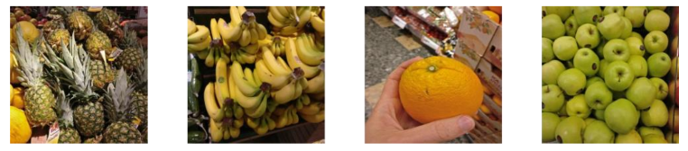

# Deep-Learning-Fruit-Classification

The aim of this project was to build a Neural Network model that was able to correctly classify fruits photos into their respective categories. The data was collected from different sources and it is a combination of natural photos taken at supermarkets and **not** fruit icons in white background. In order to build the best classifier possible, different Neural Networks architectures and different image pre-processing techniques were tested. The models will be compared and ranked by F1-score given that we are dealing with 16 unbalanced classes.

